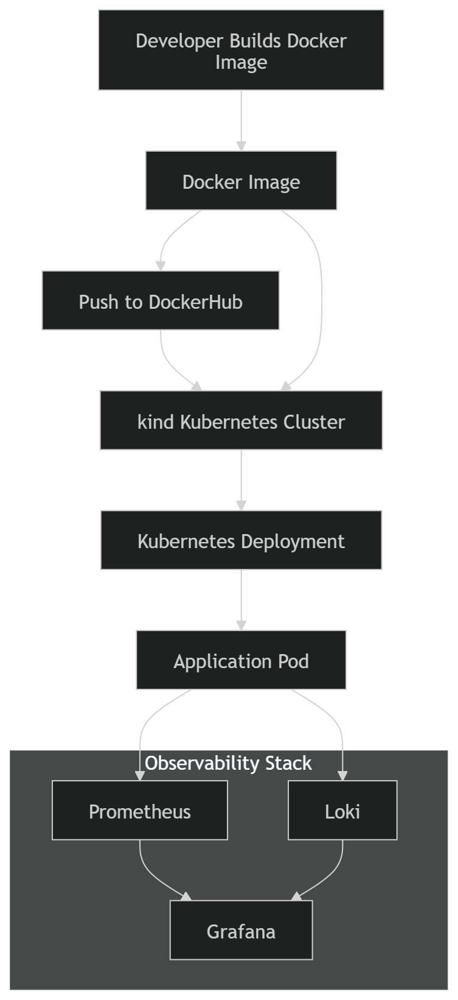

# Platform assessment

## Overview
The application is first containerized using Docker. A Docker image is built locally from the project’s Dockerfile and pushed to DockerHub so it can be easily distributed and reused. For local orchestration, a Kubernetes cluster is created using kind (Kubernetes in Docker). The built image is then loaded into the kind cluster and deployed using Kubernetes manifests, which create the necessary Pods and Services to run the application inside the cluster.

Once the application is running, observability is enabled using a monitoring and logging stack. Prometheus is deployed inside the Kubernetes cluster and periodically scrapes metrics exposed by the application, collecting time-series data such as request counts and performance metrics. These metrics are stored by Prometheus and made available for visualization. At the same time, Loki collects logs generated by the application’s Kubernetes pods, aggregating them in a centralized logging system.

Grafana acts as the unified observability interface. It connects to Prometheus as a data source for metrics and to Loki for logs. Through Grafana dashboards, users can monitor application performance, inspect system behavior, and explore logs in real time. Together, these components provide a complete local environment that demonstrates containerization, orchestration, monitoring, and logging within a Kubernetes-based workflow.

## Prerequisites

You have to install the following tools (Installation process depends on the OS, but it should be pretty straight-forward on mac and linux):
- Docker
- kubectl
- kind
- helm
- ansible
- aws cdk
- nodejs
- ansible

## How to run the app
In every folder, there is a readme file on how to run the app.
Here is the order:
1. Check the readme file of the app folder, and follow the steps there. 
You should run all the steps while the terminal is in app folder. i.e: `cd app`
2. Check the readme file of the k8s folder, and at the end, the nodejs should be running on port 3000, prometheus on port 9090, and grafana on port 3001.
You should run all the steps while the terminal is in k8s folder. i.e: `cd k8s`
3. Check the readme file of the infra folder, cdk synth outputs the cloudformation template that is saved in cdk.out
You should run all the steps while the terminal is in app folder. i.e: `cd infra`
4. Check the readme file of the ansible folder, at the end ansible will run without errors.
You should run all the steps while the terminal is in app folder. i.e: `cd ansible`
5. Github actions run by default when you push on main. There are secret variables saved on github, like dockerhub username and password, that allow to push the image on dockerhub.
To check that everything works, go to the actions tab on the github actions, and everything should look green.

## Design decisions
One design decision was to use Docker containers for components such as the Ansible host instead of setting up virtual machines with tools like VirtualBox. Using containers simplifies the environment setup and ensures consistency across different systems. This approach reduces the classic “it works on my machine” problem because the environment can be reproduced reliably using the same container images.

## Trade-offs
To keep the setup simple, environment variables were used directly in the Kubernetes deployment configuration. In a real production environment, sensitive configuration values would typically be stored in a secure secret management system such as HashiCorp Vault or Kubernetes Secrets. However, for the purposes of this project, passing environment variables in the deployment.yaml file allowed the application to be configured quickly without introducing additional infrastructure complexity.

## Improvements
With more time, several improvements could be made to streamline the workflow. For example, repetitive commands could be automated through script file to simplify the setup and deployment process. Additionally, tools like Docker Compose could be introduced to manage and run related containers more easily, making the environment easier to reproduce and reuse.